# Study Planner – Final Report (ECE1778)

> This README.md serves as the **Final Report** for the Study Planner React Native project. It describes the motivation, objectives, technical implementation, features, and instructions needed to **reproduce, build, and run** the application.

---

## 1. Team Information

> **Replace the placeholders below with your actual details.**

| Name                            | Student Number | Preferred Email                               |
| ------------------------------- | -------------- | --------------------------------------------- |
| Md Tahsin Sharif                 | 1000805113    | [tahsin.sharif@mail.utoronto.ca](mailto:tahsin.sharif@mail.utoronto.ca) |
| Mahta Miandashti                 | 1010790770    | [mahta.maindashti@mail.utoronto.ca](mailto:mahta.miandashti@mail.utoronto.ca) |
| Wenlong Zheng | 1006720247 | [wenlong.zheng@mail.utoronto.ca](mailto:wenlong.zheng@mail.utoronto.ca) |
| Zhao Ji Wang  | 1005915529 | [zhaoji.wang@mail.utoronto.ca](mailto:zhaoji.wang@mail.utoronto.ca) |

All email addresses listed above are active and may be used for clarification requests.

---

## 2. Motivation

University students often struggle with **planning, consistency, and visibility of progress** when managing multiple courses and deadlines. Traditional to-do lists or calendars do not always provide feedback, motivation, or structure tailored to academic study routines.

The motivation behind the **Study Planner** project was to design a **mobile-first, easy-to-use study management application** that helps students:

* Plan structured study sessions
* Track completion and progress visually
* Stay motivated through feedback and lightweight gamification

This project allowed us to apply concepts from the course while building a practical tool targeted at a real academic problem.

---

## 3. Objectives

The main objectives of this project were to:

1. Design and implement a **cross-platform mobile application** using React Native.
2. Provide users with the ability to **plan, manage, and track study sessions**.
3. Establish motivational structure using gamification and animations to keep students motivated to continue study progress
4. Persist user data securely using cloud and/or local storage.
5. Apply course concepts such as component-based architecture, state management, navigation, and asynchronous data handling.
6. Deliver a reproducible and extensible codebase suitable for further development.

---

## 4. Technical Stack

The application is implemented using the following technologies (as reflected in the project source code):

### Frontend & Framework

* **React Native**
* **Expo** (used for development, bundling, and running the app)
* **TypeScript**

### Navigation

* **Expo Router** (file-based routing for screen navigation)

### State Management

* **React Context API** with React hooks (`useState`, `useEffect`, `useReducer`)

### Backend / Services

* **Firebase Authentication** – user sign-in and session management
* **Firebase Firestore** – persistent cloud storage for study data

### Supporting Libraries

* Async storage for lightweight local persistence
* Date/time picker for scheduling study sessions
* Animation libraries for visual feedback and celebrations

---

## 5. Features

The Study Planner application offers the following core features:

### Study Session Management

* Create, update, and delete study sessions
* Assign sessions to specific dates and times

### Progress Tracking

* Track completion status of study sessions
* Visual indication of progress toward goals

### Motivational Feedback

* Completion animations when study goals are achieved
* Immediate visual feedback to reinforce consistency

### Persistent User Data

* Secure user authentication
* Cloud-based storage to retain data across sessions and devices

These features fulfill the course project requirements by demonstrating navigation, state management, persistence, and asynchronous operations in a mobile application.

---

## 6. User Guide

### Launching the App

1. Open the app on an Android device or emulator.
2. Navigate to the "Profile" screen
3. Click "Sign in/Create account" tab for authentication

<div align="center">
  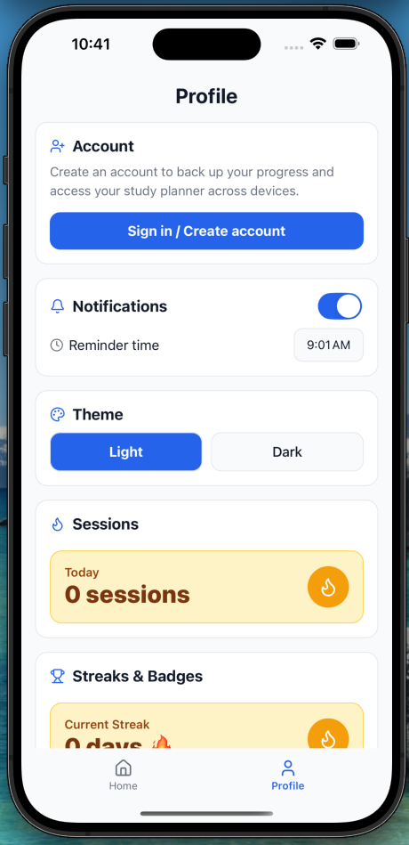
  <p><strong>Figure 1:</strong> Profile screen with Sign in / Create account option</p>
</div>

### Creating a Study Session

1. Navigate to the "Home" screen.
2. Click on "Add Session" button
3. Fill a subject, duration, and optionally note.
4. Choose date and time.
5. Save the session.


| | | |
|---|---|---|
| 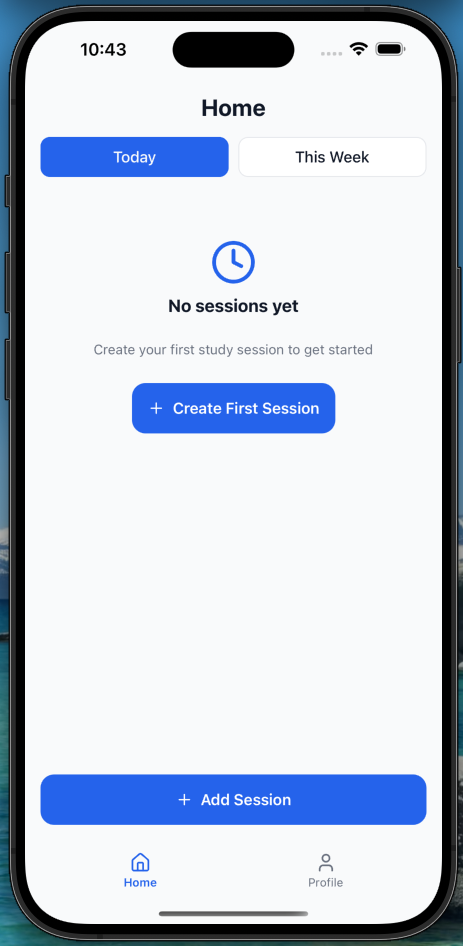 <br> **(a)** Add study session | 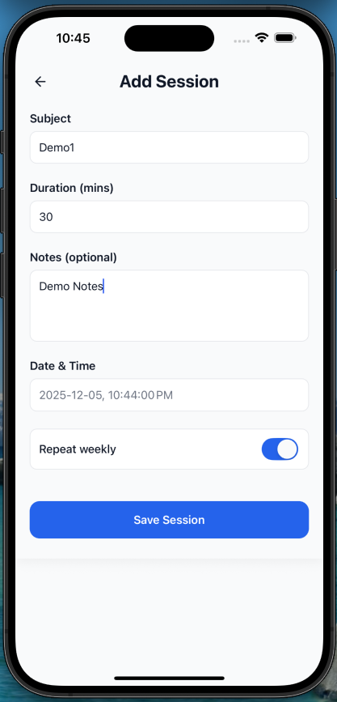 <br> **(b)** Enter session details | 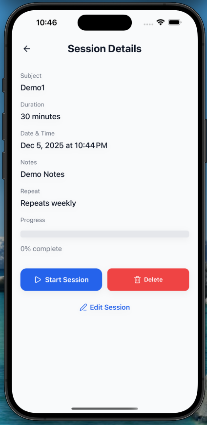 <br> **(c)** Completed session details |

<div align="center">
**Figure 2:** Creating a study session from initial setup to completed details
</div>


### Start a Study Session

1. Navigate to the "Home" screen
2. Click on the desired session
3. Click on the "Start Session" button

| | | |
|---|---|---|
| 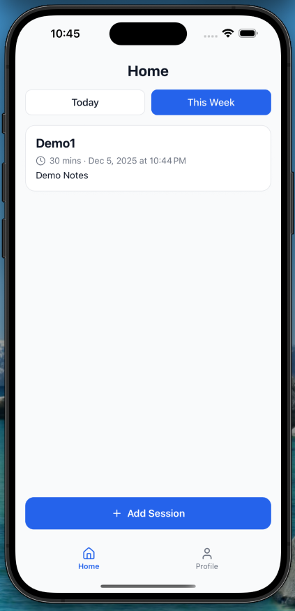 <br> **(a)** Selecting Study Session |  <br> **(b)** Confirm Session Details | 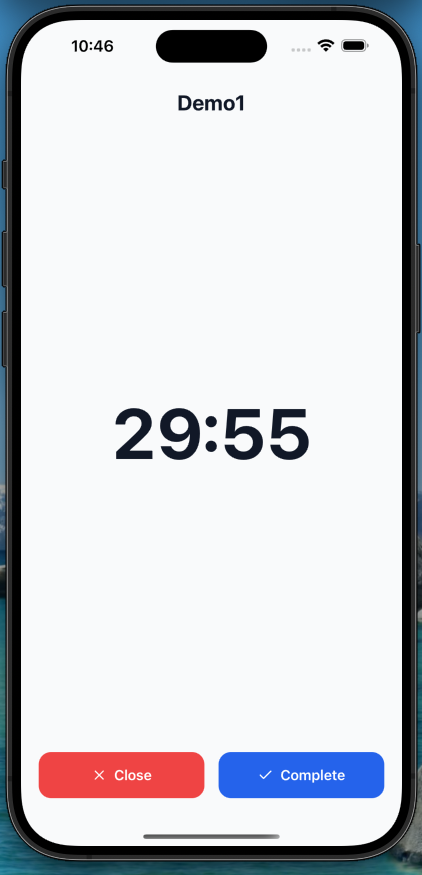 <br> **(c)** Start Study Session Timer |

<div align="center">
**Figure 3:** Starting a stored study session
</div>

### Tracking Progress

* Mark sessions as completed after studying.
* View updated progress indicators on the main dashboard.

| | |
|---|---|
| 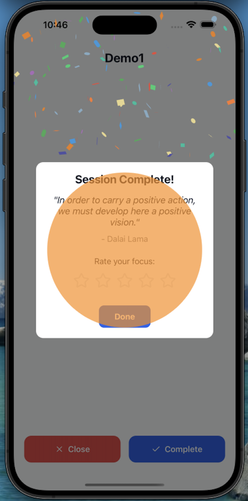 <br> **(a)** Selecting Study Session | 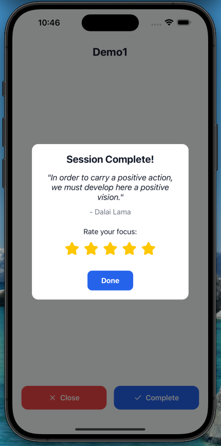 <br> **(b)** Confirm Session Details |

<div align="center">
**Figure 4:** Completing a Study Session
</div>

### Completion Feedback

* When a session or goal is completed, an animation is shown to acknowledge progress.

<div align="center">
  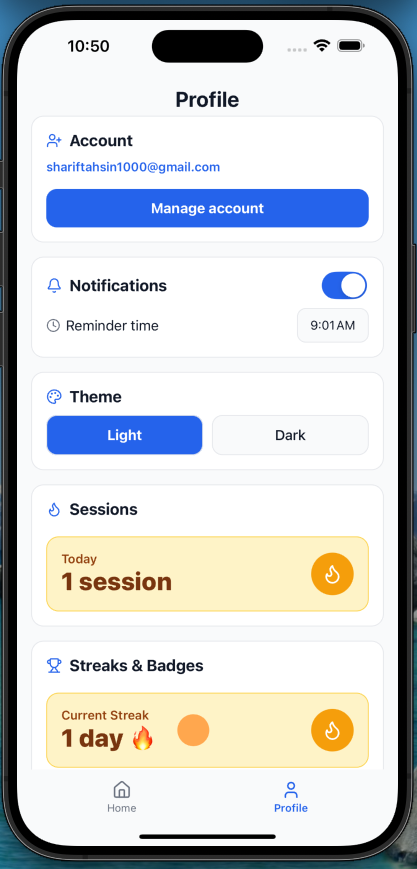
  <p><strong>Figure 5:</strong> Profile screen showing rewards and achievements</p>
</div>

## 📸 App Screenshots (Grid)

<p align="center">
  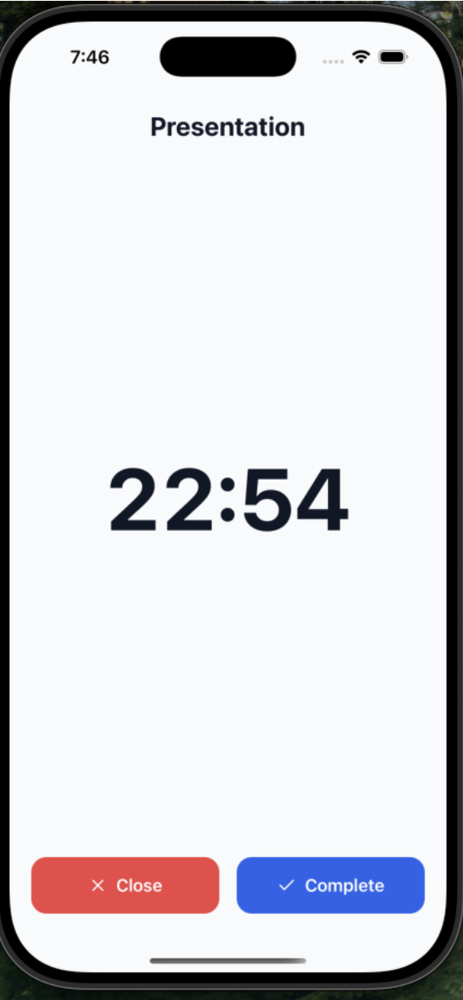
  
  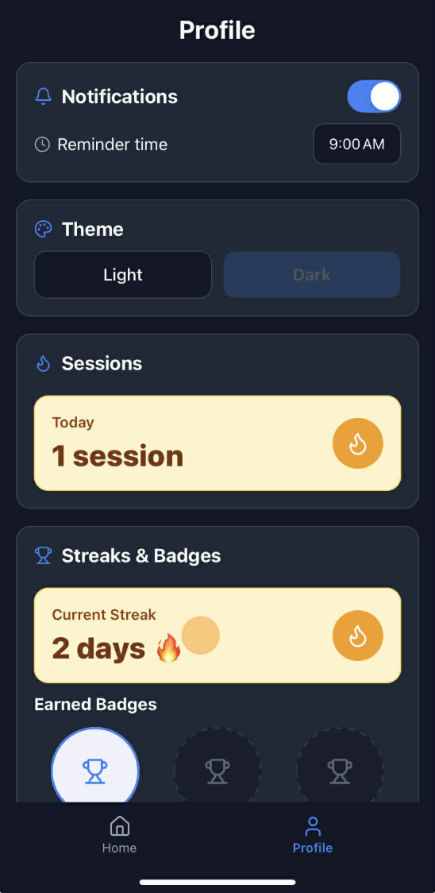
</p>

<p align="center">
  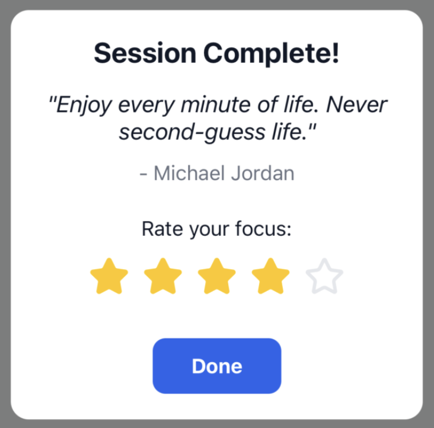
  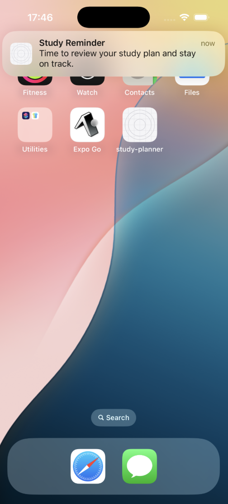
</p>

<p align="center">
  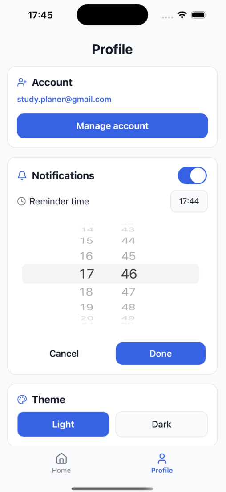
  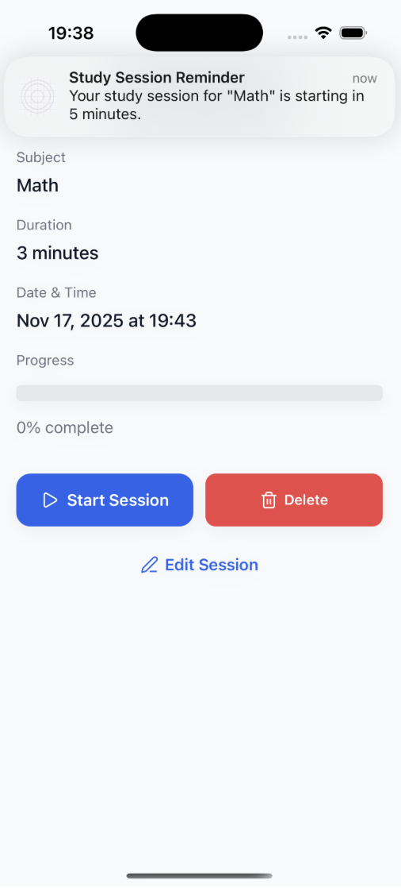
  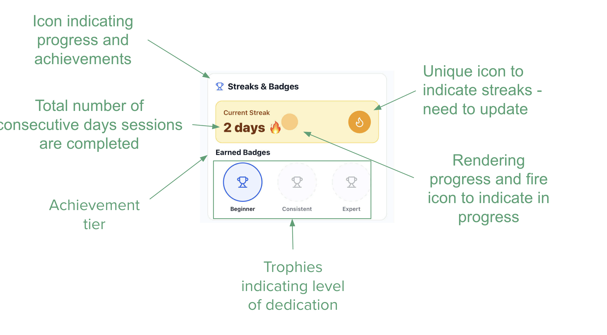
</p>

<p align="center">
  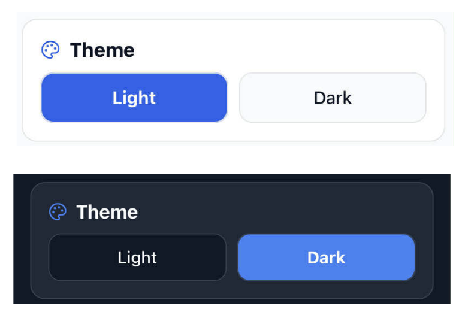
  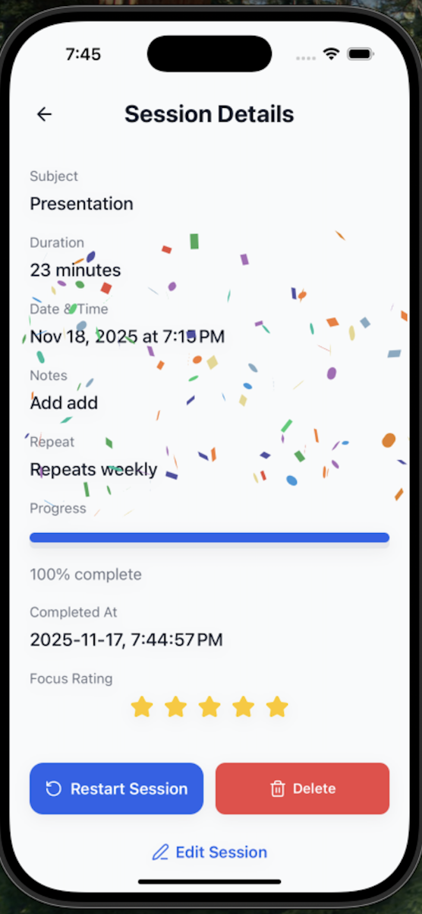
</p>
## Video Demo


---

## 7. Development Guide (Reproducibility)

### Prerequisites

Ensure the following are installed:

* Node.js (LTS version recommended)
* npm or yarn
* Expo CLI
* Android Studio (for Android development)
* Xcode (For iOS development)

Install Expo CLI globally:

```bash
npm install -g expo-cli
```

---

### Setup Instructions

1. Clone the repository:

```bash
git clone https://github.com/maahtami/study-planner-ece1778.git
cd study-planner-ece1778
```

2. Install Dependencies:

```bash
npm install
```

3. Build the project locally

```bash
npx expo prebuild --clean
```

4. Run on Android:

```bash
npx expo run:android
```

5. Run on IOS:

```bash
npx expo run:ios
```

---

### Firebase Configuration

The project includes Firebase configuration files required for authentication and database access on the root directory:

* [google-services.json ](./google-services.json)(Android)
* [GoogleService-Info.plist](./GoogleService-Info.plist)(iOS)

To reproduce the project under a different Firebase account, replace these files with your own project credentials.

---

## 8. Deployment Information

### Android Build (Required for Grading)

* Downloadable APK: https://expo.dev/artifacts/eas/h2z5covUiakh5kd8JbR31B.apk

The Android build was tested on a Android emulator.

---

## 9. Individual Contributions

* **Md Tahsin Sharif:** Implemented Gamification and Animation features. This includes:
  - Implementing code to track day streaks of completed study sessions
  - Adding Session streak section to track session streaks
  - Custom animations for study completion celebrations
  - Dynamic progress images for showing current study progress
  - Drafted README skeleton and content for final report
* **Mahta Miandashti:**
  - Designing wireframes and ensuring intuitive user flow across all screens (Home, Add Session, Details, Profile).  
  - Creating responsive layouts with accessibility compliance.  
  - Implementing navigation using Expo Router with TypeScript.  
  - Integrating icons, animations, and styling to achieve a cohesive design system.  
  - Conducting usability reviews with the team before finalizing UI components.
* **Wenlong Zheng:** Implemented Backend Services, Authentication, and Notification features. This includes:
  * Integrated `react-native-firebase/auth` to handle account creation and sign-in processes via Firebase
  * Managed user data lifecycle (creating, updating, deleting, and reading) using Firebase Firestore.
  * Configured Expo Notifications to schedule alerts for upcoming sessions and custom user-defined times
  * Designed a custom calendar to display national holidays and the user's existing sessions
* **Zhao Ji Wang:**
  * Animation on personal profile UI
  * Initial App Design

---

## 10. Lessons Learned & Concluding Remarks

This project provided hands-on experience with:

* Building a real-world mobile app using React Native and Expo
* Managing global state and navigation in a multi-screen application
* Integrating third-party backend services
* Collaborating using Git and structured commits

Overall, the Study Planner project successfully met its objectives and served as a valuable learning experience in mobile application development.

---

## License

This project was developed for academic purposes as part of **ECE1778**.
